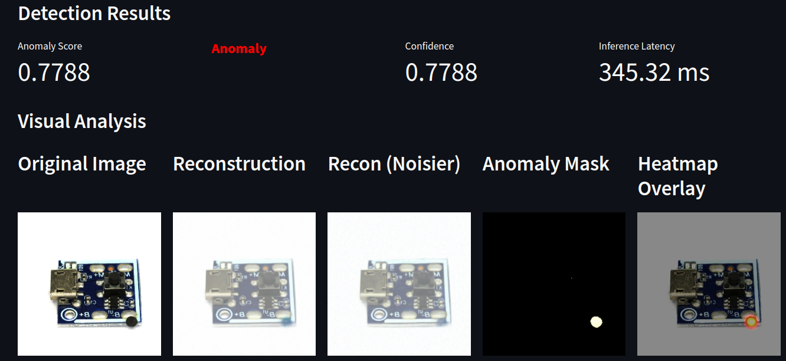

# DiffusionAD – Real-Time Industrial QC

DiffusionAD is a high-speed, high-accuracy anomaly detection system for industrial quality control using diffusion models. It detects defects without needing labeled defect images.

---

## Features

- **Batch Processing**: Process multiple images in parallel with configurable batch size
- **Latency Measurement**: Real-time inference latency tracking per image
- **Interactive Web Interface**: Streamlit-based demo with visualization
- **REST API**: FastAPI-based API for integration
- **High Contrast Visualization**: Enhanced anomaly masks and heatmaps for better visibility

## Demo

<p align="center">
  
</p>

---


## Quick Start

### 1. Setup

```bash
pip install -r requirements.txt
```

### 2. Prepare Data

Organize images like this:

```
datasets/
├── dtd/
│   └── images/
│       ├── banded/
│       ├── blotchy/
│       └── ...
└── RealIAD/
    └── PCB5/
        ├── DISthresh/
        │   └── good/
        ├── ground_truth/
        │   └── bad_mask/
        ├── test/
        │   ├── bad/
        │   └── good/
        └── train/
            └── good/
```

### 3. Train Model

```bash
python src/train.py
```

Training configuration is in `args/args1.json`. Only **good images** are needed for training. The model will be saved to `outputs/model/diff-params-ARGS=1/PCB5/`.

### 4. Run Inference

#### Web Interface (Streamlit)

```bash
streamlit run demo/app.py --server.port 8501
```

Features:
- **Single Image Analysis**: Upload and analyze individual images with detailed visualizations
- **Batch Analysis**: Process multiple images with configurable batch size (default: 8)
- **Real-time Latency**: View inference latency for each image
- **Visualizations**: 
  - Original Image
  - Reconstruction
  - Recon (Noisier)
  - Anomaly Mask (high contrast, colored)
  - Heatmap Overlay

#### Python API

```python
import sys
sys.path.append('src')
from inference import load_checkpoint, predict_image, defaultdict_from_json
import json
import torch

# Load model
device = torch.device("cuda" if torch.cuda.is_available() else "cpu")
ckpt_state = load_checkpoint('outputs/model/diff-params-ARGS=1/PCB5/params-last.pt', device)
args = defaultdict_from_json(json.load(open('args/args1.json')))

# Initialize models (see src/inference.py for full example)
# ...

# Predict single image
result = predict_image(unet_model, seg_model, ddpm, 'test_image.jpg', args, device)

# Batch prediction
from inference import predict_batch
results = predict_batch(unet_model, seg_model, ddpm, image_arrays, args, device, 
                       batch_size=8)
```

#### REST API (FastAPI)

```bash
# Start API server
cd api
uvicorn app:app --host 0.0.0.0 --port 8000

# Make prediction
curl -X POST "http://localhost:8000/predict" -F "file=@test_image.jpg"
```

---

## Output

* **Anomaly Score**: Numerical value (0-1) indicating anomaly probability
* **Anomaly Mask**: High contrast colored mask showing defect locations (HOT colormap)
* **Heatmap Overlay**: Overlay of anomaly heatmap on original image
* **Reconstruction**: Model's reconstruction of the input image
* **Inference Latency**: Time taken for inference (in milliseconds)

---

## Project Structure

```
diffuisionAD/
├── src/
│   ├── train.py          # Training script
│   ├── inference.py      # Inference functions (single & batch)
│   ├── eval.py           # Evaluation script
│   ├── models.py         # Model definitions
│   └── utils.py          # Utility functions
├── demo/
│   └── app.py            # Streamlit web interface
├── api/
│   └── app.py            # FastAPI REST API
├── args/
│   └── args1.json        # Training arguments
├── datasets/             # Dataset directory
└── outputs/              # Model outputs and checkpoints
    └── model/
        └── diff-params-ARGS=1/
            └── PCB5/
                └── params-last.pt
```

---

## Configuration

Training parameters are configured in `args/args1.json`. Key parameters:
- `img_size`: Input image size
- `batch_size`: Training batch size
- `T`: Diffusion timesteps
- `eval_normal_t`, `eval_noisier_t`: Evaluation timesteps
- `base_channels`: Base channels for UNet
- `channel_mults`: Channel multipliers for UNet

---


